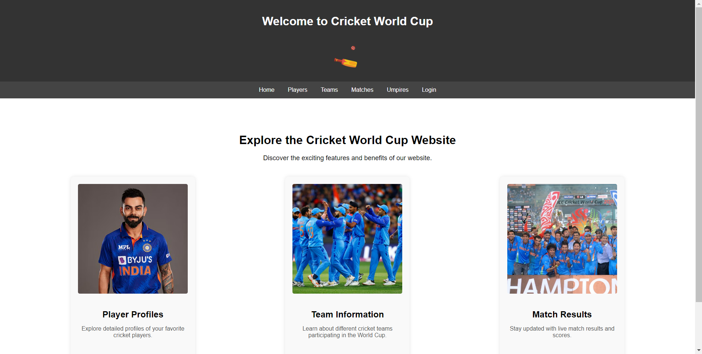
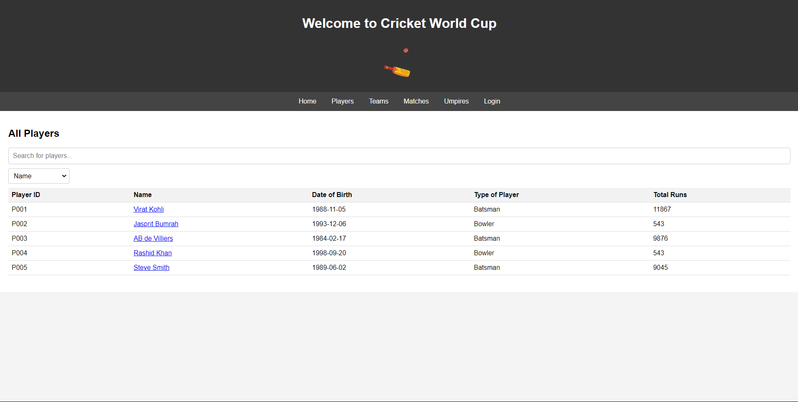
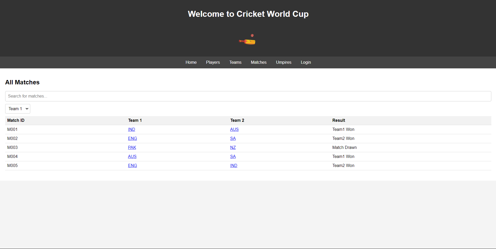

# Cricket Statistics Web Application

## Overview

This project is a web application designed to manage and analyze cricket statistics. The application is built using Flask and MySQL, and provides detailed insights into players, teams, matches, umpires, and stadiums. It allows users to view and interact with data through a user-friendly interface.

## Features

- **Player Management:** View details of players and their statistics.
- **Team Management:** View details of teams and their performance.
- **Match Management:** View details of matches and results.
- **Umpire Management:** View details of umpires.
- **Stadium Management:** View details of stadiums and their capacity utilization.
- **Advanced Queries:** Perform complex queries for in-depth analysis.
- **User Authentication:** Basic login functionality for secure access.

### Prerequisites

- Python 3.x
- MySQL Server

>Update the config.py file with your database configuration
>
    dbconfig = {
      'user': 'your_db_user',
      'password': 'your_db_password',
      'host': 'localhost',
      'database': 'cricketwc'
    }

## Screenshots

### Authors
<ul>
  <li><a href="https://github.com/ShubhamK-S">Shubham Kumar Singh</a>
  <li><a href="https://github.com/is-shaun"> Ishan </a>
  <li><a href="https://github.com/sajaltandon">Sajal Tandon</a>
</ul>
    
### License

This project is licensed under the MIT License. See the 'LICENSE' file for details.
